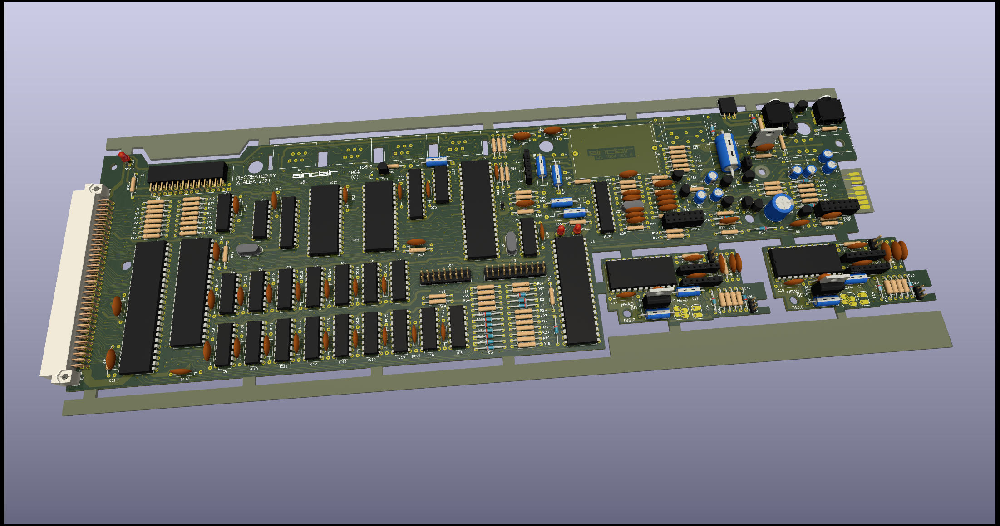
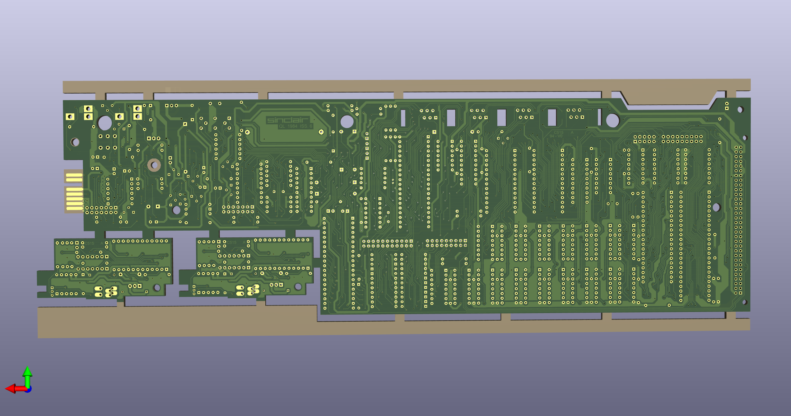

# Sinclair QL - Schematics & PCB
Schematic, PCB of the Sinclair QL Computer

(C) 2024 Alvaro Alea Fdz.

License under: CERN Open Hardware Licence Version 2 - Strongly Reciprocal

https://ohwr.org/cern_ohl_s_v2.txt

## Folder: Issue_6
This folder contain the schematic of the original Issue 6 of sinclair QL, from pictures found on internet.

### STATUS
- Schematic - 100% draw, ERC Passed
- PCB - 100% draw, ERC passed
- NOT TESTED

### TODO
- Verify Dimensions
- Minor silkscreen details
- normalice size of vias

## Folder: Issue_5
Future schematic of the Issue 5

### STATUS
- Schematic - 75% HAL chip remove from Issue 6, other changes pending.
- PCB - 50% draw, incomplete, actually based on Issue 6, no data of real PCB.
- INCOMPLETE, NOT TESTED

## Folder: Issue_7ALEA
Future schematic & PCB of a improved Sinclair QL with moderm components.

### STATUS
- Schematic - 100% draw, ERC Passed
- PCB - 100% draw, ERC passed
- NOT TESTED

### DONE
- Change VCC track to GND to enhaced microdrive operation (mandatory mod. of service manual)

### TODO
- Other mod of service manual
- Aereal componentes
- Other mod by german issues
- replace mc1488 y mc1489 by max232
- replace serial conector by  DB9
- replace RAM by 4x (64x8) chips (Spectrum +2A)

### GOOD IDEAS
- replace ROM by ssf39a40 (512Kb)
- remove Composite out and RGB and replace by VGA (rp2040)
- split microdrive and power supply circuits
- remplace 68008 by 68020 at 15Mhz.
- Add 2x 512Kb sram (16bits access with 68020)
- Add floppy interface
- Add RTC
- Add rp2040 for USB keyboard
- Add Qimsi mouse (using same rp2040 of keyboard?)

### FRIKI
- Add 2x 1024Kb sram (16bits access with 68020)
- Add a PSG
- Add qubide interface
- Add footprint for Lion's ZX8301 replacement
