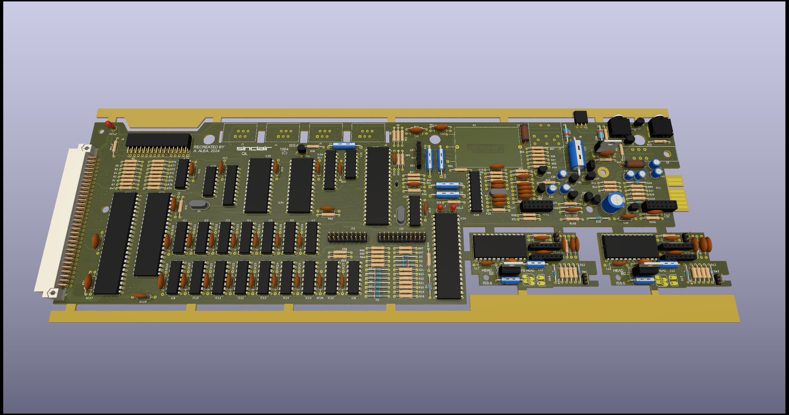
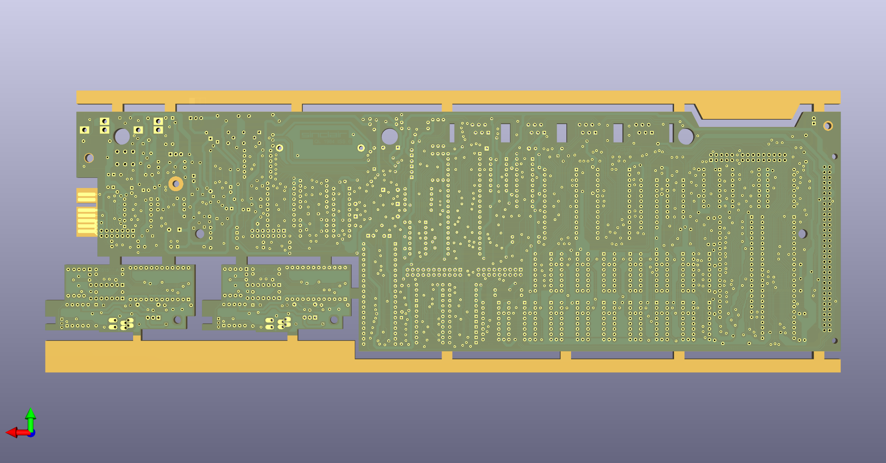
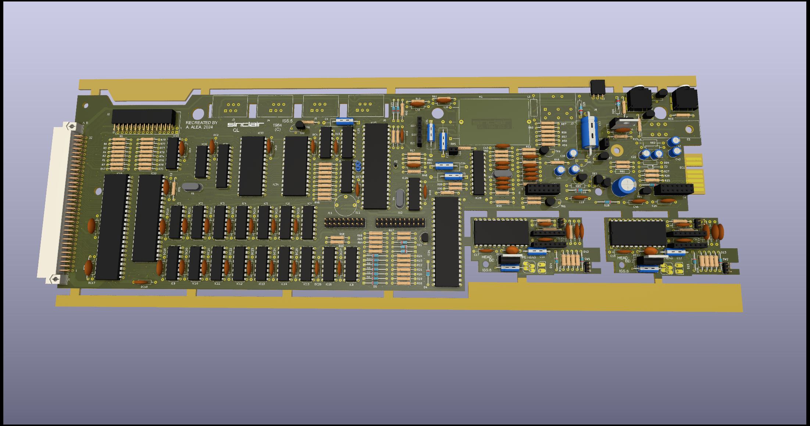
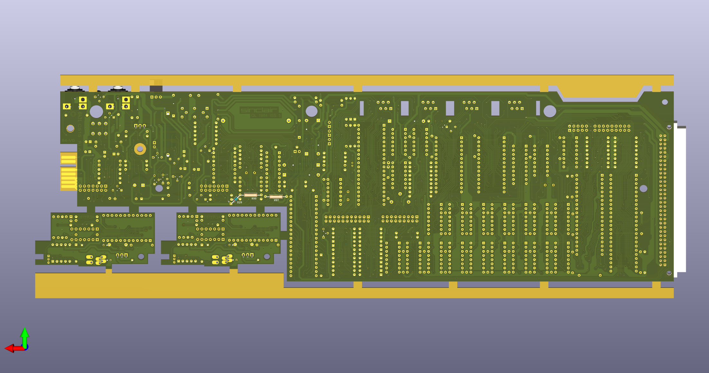

# Sinclair QL - Schematics & PCB
Schematic, PCB of the Sinclair QL Computer

(C) 2024 Alvaro Alea Fdz.

License under: CERN Open Hardware Licence Version 2 - Strongly Reciprocal

https://ohwr.org/cern_ohl_s_v2.txt

## Folder: Issue_6
This folder contain the schematic of the original Issue 6 of sinclair QL, from pictures found on internet.

### STATUS
- Schematic - 100% draw, ERC passed
- PCB - 100% draw, ERC passed
- NOT TESTED

### TODO
- Minor silkscreen details
- normalice size of vias

## Folder: Issue_5
This folder contain the schematic of the Issue 5

### STATUS
- Schematic - 99% draw, ERC passed
- PCB - 99% draw, ERC passed incomplete, component side is 99%, at least 1 track missing, solder side is 100%, but 1 aditional track was need to complete the schematic.
- NOT TESTED

## Folder: Issue_2
Future schematic of the Issue 2

### STATUS
- Schematic - 0% not evaluated.
- PCB - 5% draw, incomplete, actually based on Issue 6, Got Good Picture of Solder side (90% Cover) and data from componentes (about 25%)
- INCOMPLETE, NOT TESTED

## Folder: Issue_7ALEA
Future schematic & PCB of a improved Sinclair QL with moderm components.

### STATUS
- Schematic - 100% draw, ERC Passed
- PCB - 100% draw, ERC passed
- NOT TESTED

### DONE
- Change VCC track to GND to enhaced microdrive operation (mandatory mod. of service manual)
- Incorporate R107,108 on PCB, not need to solder over ZX8302
- Incorporate 5 diodes on PCB, not need to solder over ZX8301 to protect it

### TODO
- Other mod of service manual
- Aereal componentes
- Other mod by german issues
- replace mc1488 y mc1489 by max232
- replace serial conector by  DB9
- replace RAM by 4x (64x8) chips (Spectrum +2A)

### GOOD IDEAS
- replace ROM by ssf39a40 (512Kb)
- remove Composite out and RGB and replace by VGA (rp2040)
- split microdrive and power supply circuits
- remplace 68008 by 68020 at 15Mhz.
- Add 2x 512Kb sram (16bits access with 68020)
- Add floppy interface
- Add RTC
- Add rp2040 for USB keyboard
- Add Qimsi mouse (using same rp2040 of keyboard?)

### FRIKI
- Add 2x 1024Kb sram (16bits access with 68020)
- Add a PSG
- Add qubide interface
- Add footprint for Lion's ZX8301 replacement
